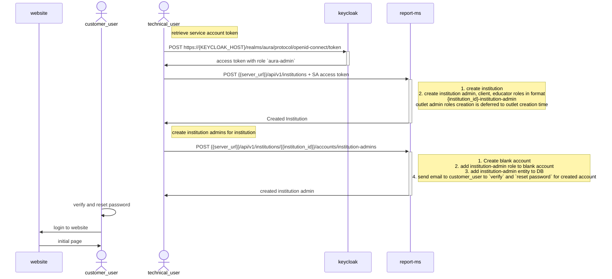
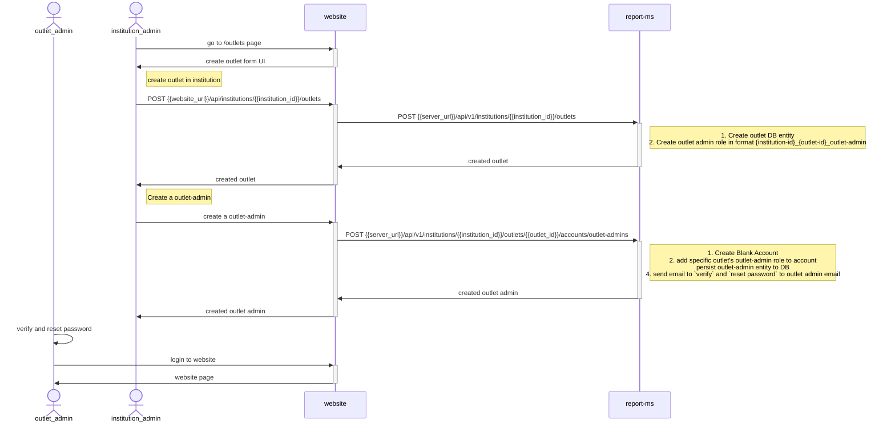
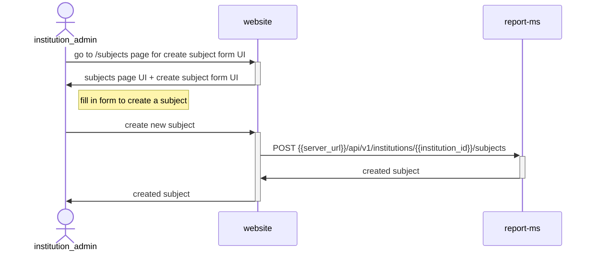
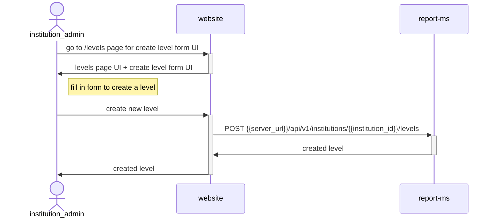
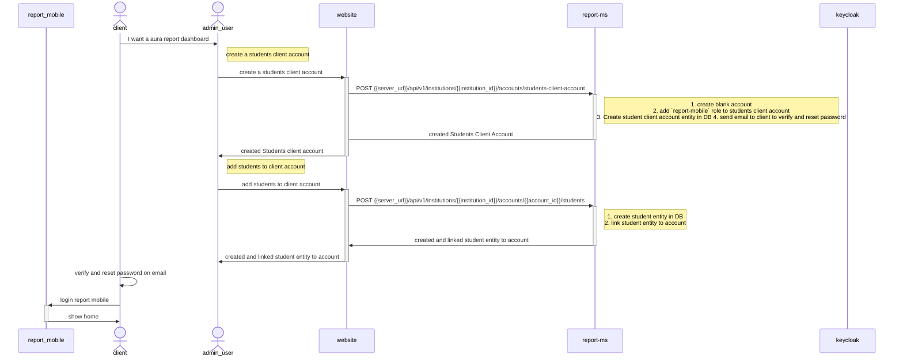
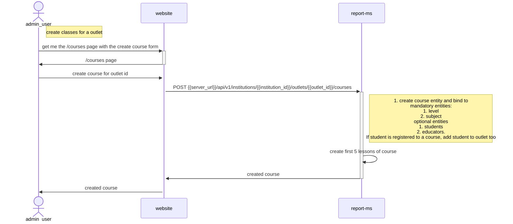

### New Institution Admin user flow

> Mandatory actions to complete before being able to register students

0. create a institution
1. register at least 1 outlet
2. create subjects
3. create levels
4. create classes
5. register students

## Register Outlets (optional, if no outlets, all outlet dropdowns are empty)

# Onboarding institution flow

This action can only currently be done by a technical user. the technical user needs to have the `aura-admin` role to access the `create institution api`. the access token for with aura-admin role can be retrieved as a `service-account` of the `aura-application-client` via the `client-credential` flow

Note:

1. Creating a blank account refers to creating a keycloak user that is not enabled and also persisting the account entity in DB; no roles are given yet. the tenant-id (which is the institution_id) is also added the the keycloak user's `ext_attr.tenant_ids` field. This will allow the access token of the token to store the state of the user's allowed tenants. `This is useful because it will remove the need for api calls to the api server to check which institution the user is`

# Register an outlet

> A new institution must at least register 1 outlet

# Create Subjects (institution level)

Subjects are institution level entities and are shared across outlets. The same applies for accounts

# Create Levels (institution level)

Levels are institution level entities and are shared across outlets. The same applies for accounts

# Create Students (Institution level + outlet level)

Note: This flow is pretty similar for educators.

Students exist on a institution level. but can be bound to multiple outlets of that institution. Prior to creating a student, the `admin (outlet_admin or institution_admin)` must first create a `client account`. Then the `admin` can create `students` to add to the `client account`. the student can then be bound different `outlets`. Note that students are not bound to this outlet just because they are registered here. the students will be bound to an outlet only after they register for a course in that outlet

# Create Classes/Courses (Outlet level entities)

Classes exist on the outlet level and not the institution level. a institution_admin can create courses for every outlet. a outlet_admin can only create courses for his own outlet. both will be referred as admin_user in this diagram

# Create Lessons

# Create Educators
