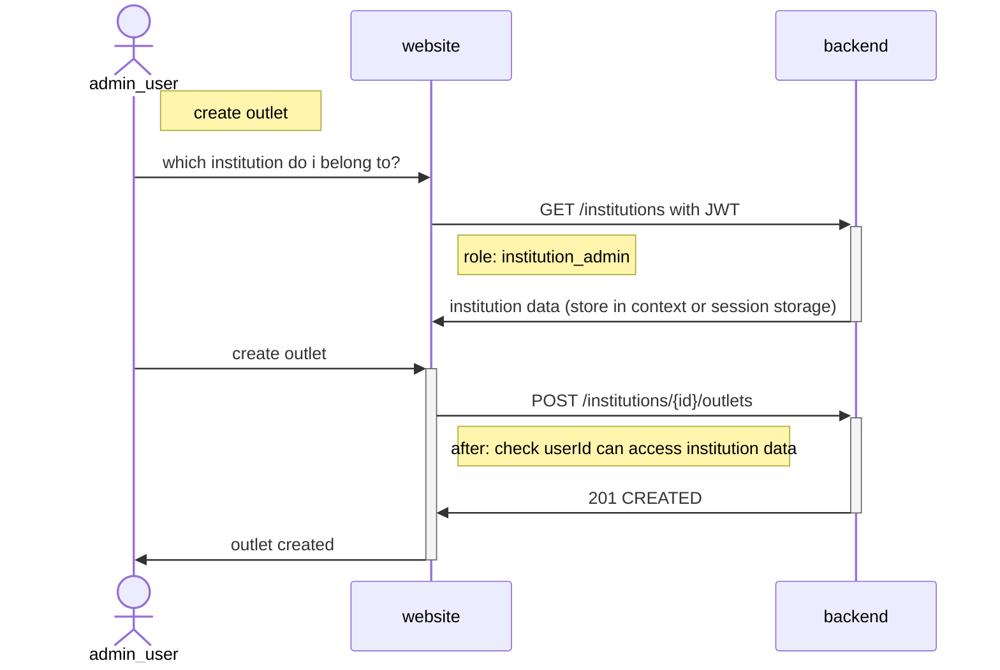
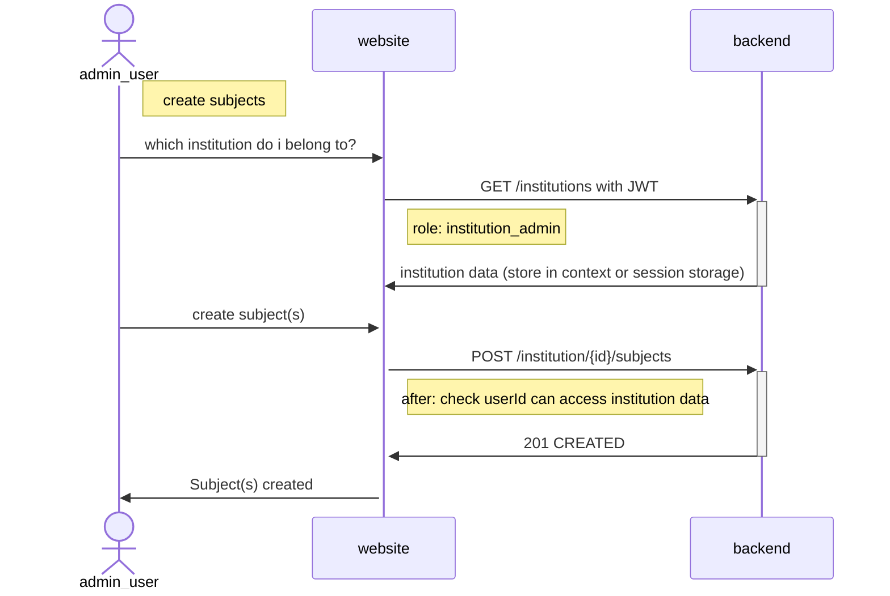
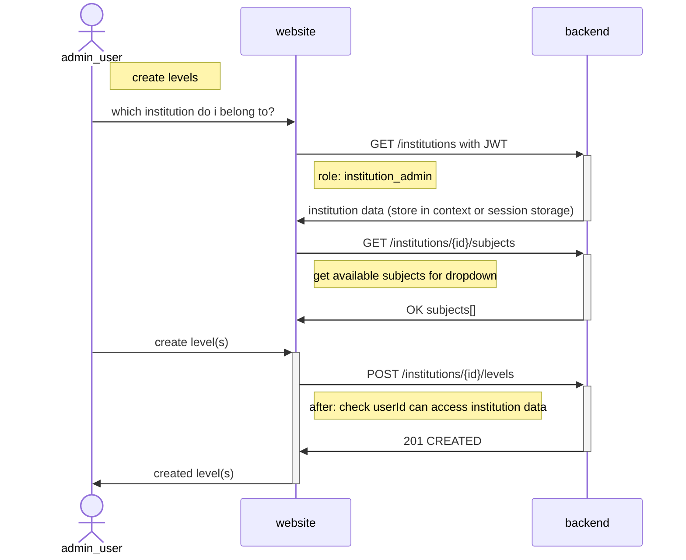
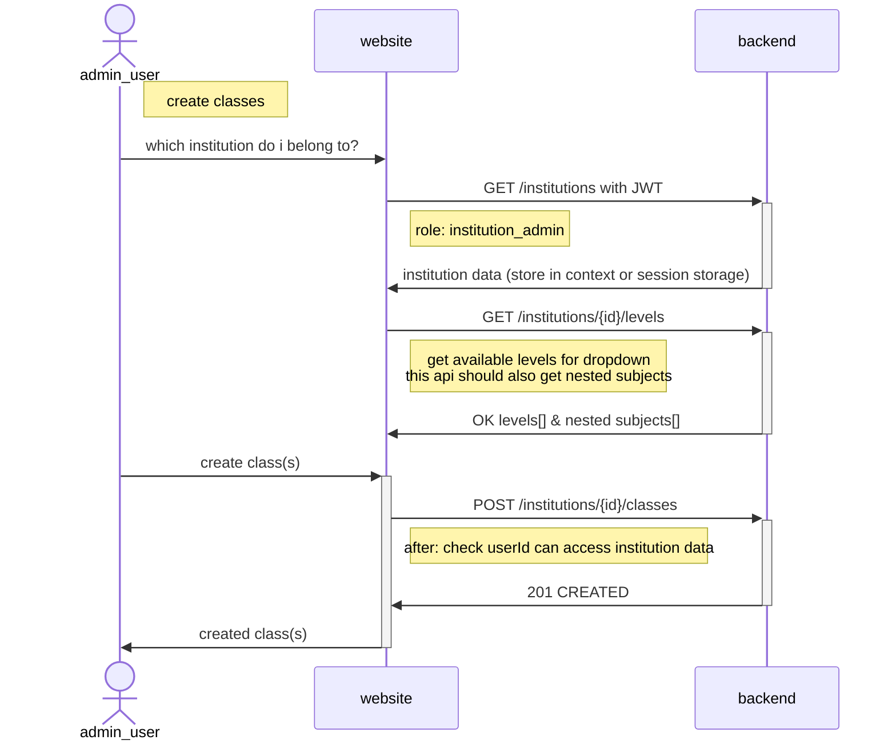
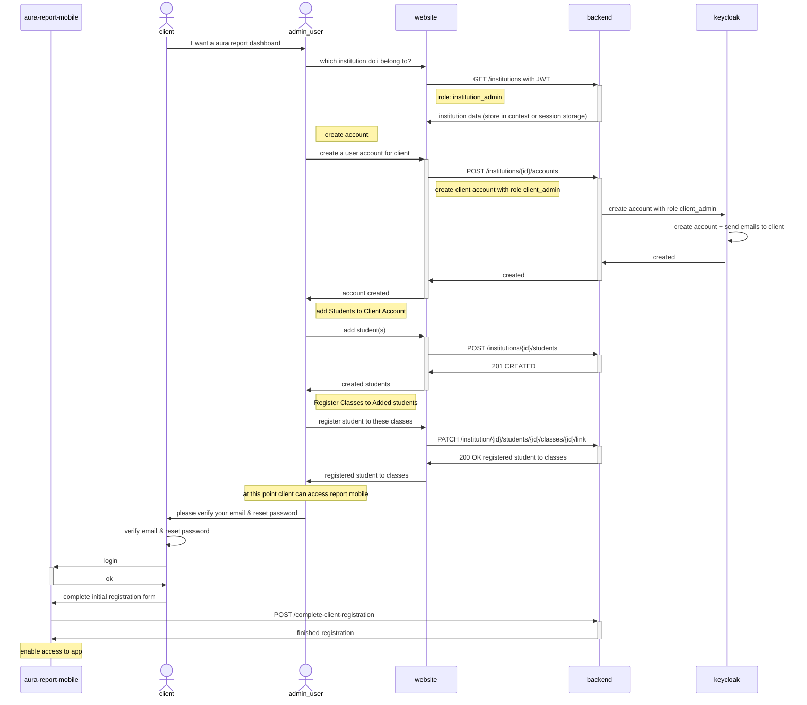

### New Institution Admin user flow

> Mandatory actions to complete before being able to register students

1. register at least 1 outlet
2. create subjects
3. create levels
4. create classes
5. register students

## Register Outlets (optional, if no outlets, all outlet dropdowns are empty)

# Register outlet

> A new institution must at least register 1 outlet

# Create Subjects

# Create Levels

# Create Classes

# Create Students

# Create Lessons

# Create Educators
