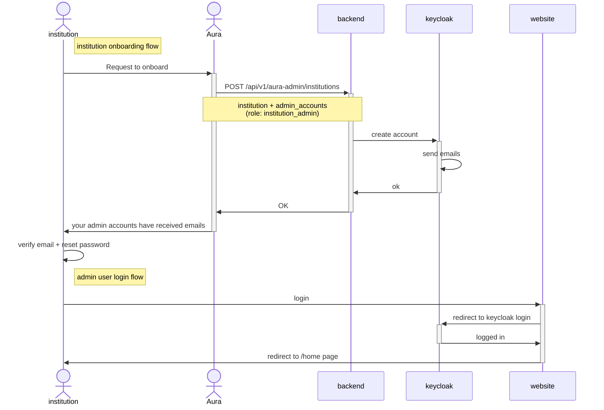

### Onboarding Institution Flow & login flow

```mermaid
sequenceDiagram
    actor institution
    actor Aura
    participant backend
    participant keycloak
    participant website
    note right of institution: institution onboarding flow
    institution ->> +Aura: Request to onboard
    Aura ->> +backend: POST /api/v1/aura-admin/institutions
    Note over Aura,backend: institution + admin_accounts <br/> (role: institution_admin)
    backend ->> +keycloak: create account
    keycloak ->> keycloak: send emails
    keycloak ->> -backend: ok
    backend ->> -Aura: OK
    Aura ->> -institution: your admin accounts have received emails
    institution ->> institution: verify email + reset password

    note right of institution: admin user login flow
    institution ->> +website: login
    website ->> +keycloak: redirect to keycloak login
    keycloak ->> -website: logged in
    website ->> -institution: redirect to /home page
```
